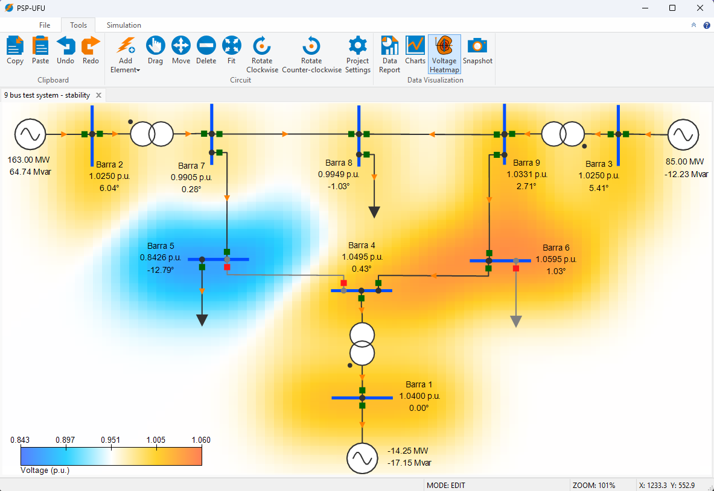
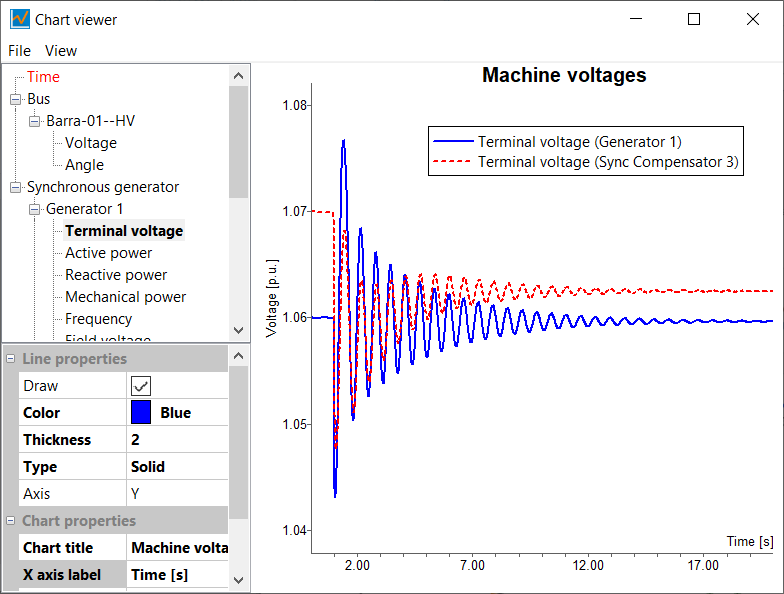
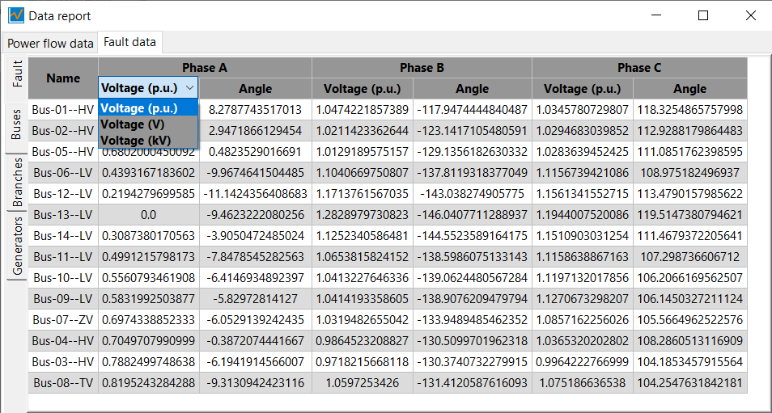

<!-- [](https://www.codacy.com/manual/ Thales1330/PSP?utm_source=github.com&amp;utm_medium=referral&amp;utm_content=Thales1330/PSP&amp;utm_campaign=Badge_Grade) -->
[](https://github.com/Thales1330/PSP/actions/workflows/build-windows.yml)
[](https://github.com/Thales1330/PSP/actions/workflows/build-linux.yml)
[](https://bestpractices.coreinfrastructure.org/projects/3287)
[](https://www.gnu.org/licenses/old-licenses/gpl-2.0.en.html)
[](https://zenodo.org/badge/latestdoi/64333860)


[**PSP-UFU website**](https://thales1330.github.io/PSP/)

PSP-UFU (Power Systems Platform of Federal University of Uberlândia) is a **cross-platform**, **multilingual**, **Free and Open-Source Software** (FOSS) with **advanced GUI** (Graphical User Interface) features and **CAD** (Computer-Aided Design) tools for power system studies.

The software allows for the construction of any electric **transmission network** and **control systems** through the deployment of visual elements.

For the visualization of results, the program offers linked text elements in the main screen, and also table and graph editors.

The PSP-UFU  aims to provide efficient computer simulation tools for **research and education purposes**, in addition to **industrial applications** in electrical power systems.

The software can perform the following studies:

- **Power Flow**
  - Newton-Raphson
  - Gauss-Seidel
  - Hybrid Newton-Gauss
  - Three-phase induction motors included in power flow studies
- **Short-Circuit calculation**
  - Balanced
  - Unbalanced
  - Short-Circuit power in all system buses
- **Harmonics**
  - Harmonic voltages and THD (Total Harmonic Distortion) calculation
  - Frequency scan
- **Transient and Dynamic Stability**
  - Several synchronous machine models automatically selected
  - Three-phase induction motors
  - User-defined machine controls, exciters and prime moves created using block diagrams (Exciters, AVR, PSS, Hydro and Thermal turbines, Speed Governor, etc.)
  
## [](#header-2)📚 Published Papers
Further details can be found in the published papers:

>Oliveira, T. L., Guimarães, G. C., & Silva, L. R. C. (2019). PSP-UFU: An open-source, graphical, and multiplatform software for power system studies. _International Transactions on Electrical Energy Systems_, e12185. doi: [10.1002/2050-7038.12185](https://doi.org/10.1002/2050-7038.12185)

>Oliveira, T. L., Guimarães, G. C., Silva, L. R., & Rezende, J. O. (2019). Power system education and research applications using free and open-source, graphical and multiplatform PSP-UFU software. _The International Journal of Electrical Engineering & Education_, 0020720919879058. doi: [10.1177/0020720919879058](https://doi.org/10.1177/0020720919879058)

## [](#header-2)📖 Code Documentation

All detailed descriptions of the source-code can be found at [**Online Documentation**](https://thales1330.github.io/PSP/doxygen/html/index.html), generated by [Doxygen](http://www.doxygen.org).

## [](#header-2)⚙️ Build Instructions (via CMake)

To compile **PSP‑UFU**, make sure the `CMakeLists.txt` file is located at the root of the repository.

### Prerequisites

| Tool           | Version          | Download Link |
|----------------|------------------|----------------|
| **CMake**      | ≥ 3.21 (minimum 3.5) | [cmake.org/download](https://cmake.org/download/) |
| **Git**        | Any recent version | [git-scm.com](https://git-scm.com/downloads) |
| **wxWidgets**  | Fetched automatically (v3.3.1) | — |
| **Visual Studio** (Windows) | 2022 or later (x86 support) | [visualstudio.microsoft.com](https://visualstudio.microsoft.com/downloads/) |
| **GCC / Clang** (Linux) | C++20 compatible | Available via package manager |

---

### [](#header-23)🖥️ Windows (Visual Studio, Win32)

```bash
git clone https://github.com/Thales1330/PSP.git
cd PSP
mkdir build
cd build
cmake .. -G "Visual Studio 17 2022" -A Win32
cmake --build . --config Release
```
The executable will be located at: build/bin/Release/PSP-UFU.exe

### [](#header-3)🐧 Linux (GCC or Clang)
```bash
sudo apt update
sudo apt install build-essential cmake git libgtk-3-dev libx11-dev libglu1-mesa-dev

git clone https://github.com/Thales1330/PSP.git
cd PSP
mkdir build
cd build
cmake -DCMAKE_BUILD_TYPE=Release ..
cmake --build .
```

The executable will be generated at: build/bin/PSP-UFU

## [](#header-2)Overview









