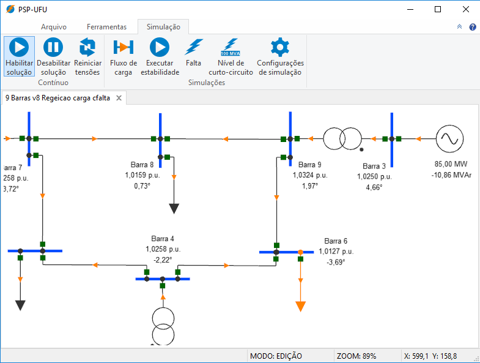
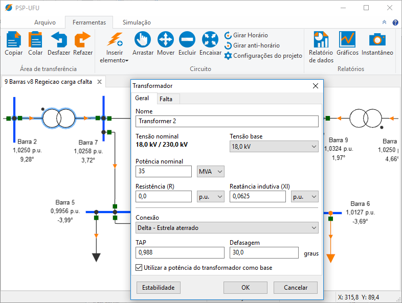
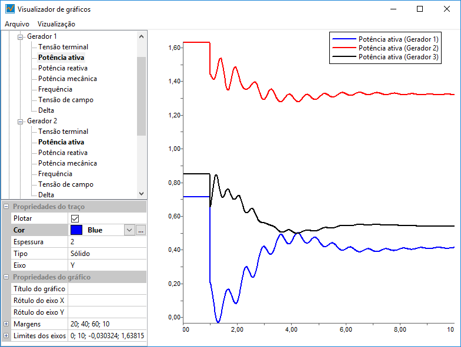
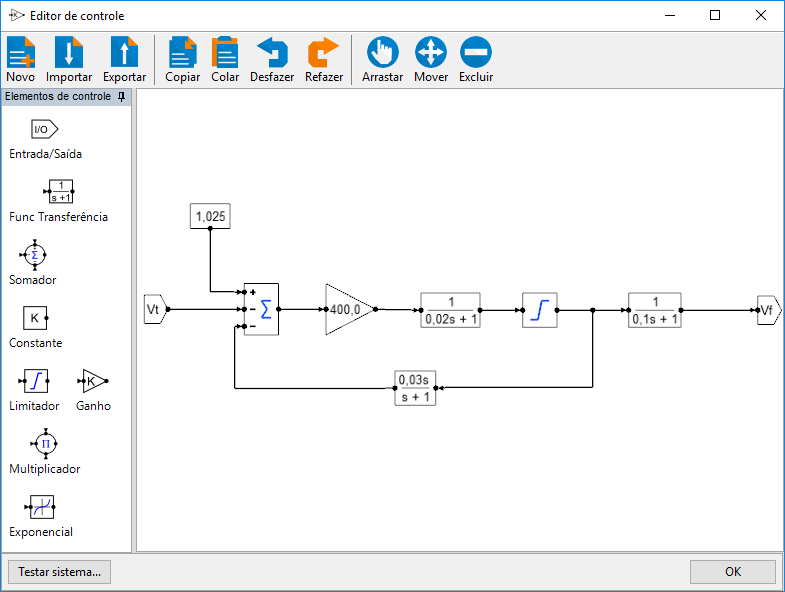

O PSP-UFU (Plataforma de Sistemas de Potência da Universidade Federal de Uberlândia) é um _software_ **gráfico**, **gratuito**, **multiplataforma** e de **código aberto** para estudos em sistemas elétricos de potência.

A GUI (_Graphical User Interface_) é amigável e permite que o usuário realize simulações com apenas alguns cliques.

Por meio de ferramentas gráficas o usuário poderá criar qualquer rede elétrica, inserindo e editando elementos de potência. Também é possível importar, criar e editar os controles das máquinas síncronas utilizando diagrama de blocos.

Para a vizualização de resultados o programa possui elementos de texto na tela principal, tabelas e gráficos.

O _software_ permite a realização dos seguintes estudos:

- **Fluxo de carga**
- **Curto-circuito**
  - Simétrico
  - Assimétrico
  - Nível de curto-circuito em todas as barras
- **Estabilidade eletromecânica**
  - Vários modelos de máquinas síncronas
  - Criação e edição de controle (tensão e velocidade) genéricos

## [](#header-2)Documentação

Toda a descrição detalhada do código fonte pode ser encontrada na [**Documentação Online**](doxygen/html/index.html)

## [](#header-2)Screenshots









```
Desenvolvido por Thales Lima Oliveira
```
