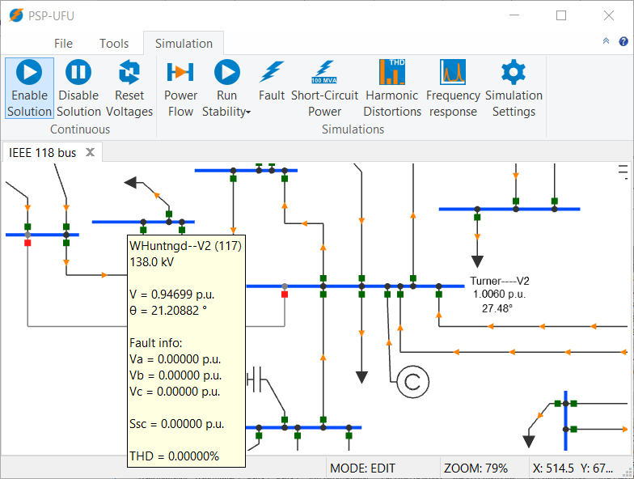
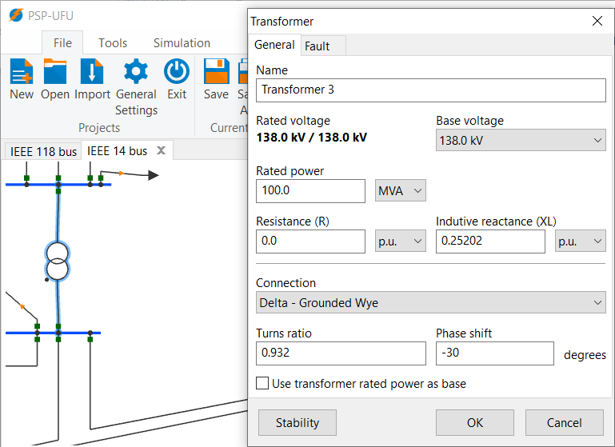
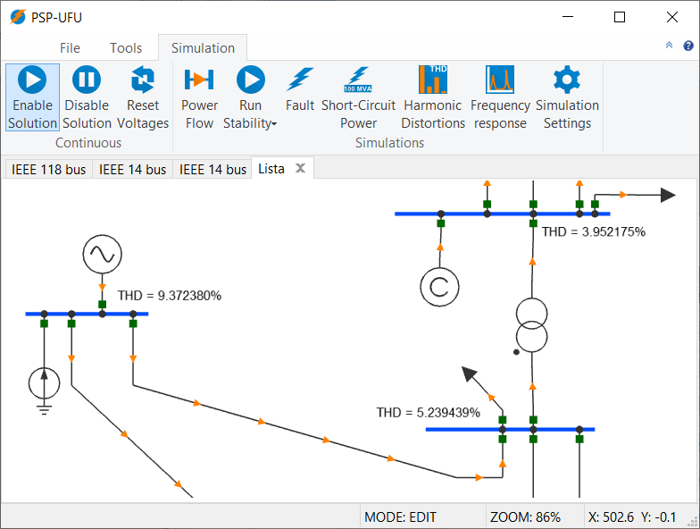

PSP-UFU (Power Systems Platform of Federal University of Uberlândia) is a **cross-platform**, **multilingual**, **Free and Open-Source Software** (FOSS) with **advanced GUI** (Graphical User Interface) features and **CAD** (Computer-Aided Design) tools for power system studies.

The software allows for the construction of any electric **transmission network** and **control systems** through the deployment of visual elements.

For the visualization of results, the program offers linked text elements in the main screen, and also table and graph editors.

The PSP-UFU  aims to provide efficient computer simulation tools for **research and education purposes**, in addition to **industrial applications** in electrical power systems.

The software can perform the following studies:

- **Power Flow**
  - Newton-Raphson
  - Gauss-Seidel
  - Hybrid Newton-Gauss
  - Three-phase induction motors included in power flow studies
- **Short-Circuit calculation**
  - Balanced
  - Unbalanced
  - Short-Circuit power in all system buses
- **Harmonics**
  - Harmonic voltages and THD (Total Harmonic Distortion) calculation
  - Frequency scan
- **Transient and Dynamic Stability**
  - Several synchronous machine models automatically selected
  - Three-phase induction motors
  - User-defined machine controls, exciters and prime moves created using block diagrams (Exciters, AVR, PSS, Hydro and Thermal turbines, Speed Governor, etc.)
  
## Published Papers
Further details can be found in the published papers:

>Oliveira, T. L., Guimarães, G. C., & Silva, L. R. C. (2019). PSP-UFU: An open-source, graphical, and multiplatform software for power system studies. _International Transactions on Electrical Energy Systems_, e12185. doi: [10.1002/2050-7038.12185](https://doi.org/10.1002/2050-7038.12185)

>Oliveira, T. L., Guimarães, G. C., Silva, L. R., & Rezende, J. O. (2019). Power system education and research applications using free and open-source, graphical and multiplatform PSP-UFU software. _The International Journal of Electrical Engineering & Education_, 0020720919879058. doi: [10.1177/0020720919879058](https://doi.org/10.1177/0020720919879058)

## Code Documentation

All detailed descriptions of the source-code can be found at [**Online Documentation**](doxygen/html/index.html), generated by [Doxygen](http://www.doxygen.org).

## Screenshots

Developed by Thales Lima Oliveira (<thales@ufu.br>)
